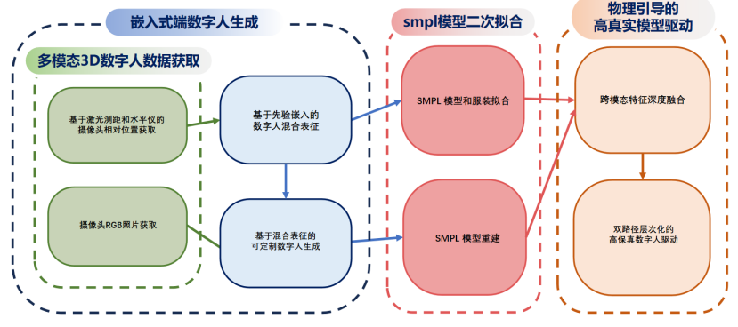

# 基于RK3588的高保真3D虚拟数字人构筑系统
本项目主要包含基于嵌入式端的高保真3D虚拟人生成的完整项目，为二次拟合部分提供了全部的核心代码，将对应代码或代码文件夹覆盖源项目对应文件即可，驱动部分可参考LHM项目，该项目提供了完善的中文介绍。整体流程如下：

针对复现做出如下说明：

将项目中的fit_SMPLicit文件夹和SMPLicit文件夹替换SMPLicit文件夹对应文件，同时参照本项目中的SMPL类对SMPL类进行修改即可复现SMPLicit相关功能。

ppo文件夹中已经包含了一个基于nao机器人的模型重建样例，坐标参数的获取是基于前向运动学的简单计算，核心思想为针对机器人创建新的SMPL节点，进而实现机器人的SMPL重建，后续机器人驱动内容与本项目无关，且尚未开源。

LHM项目为基于图片生成SMPL模型后将图片和SMPL模型作为输入源进行渲染，将SMPL模型替换为我们生成的含transSMPL模型即可（此处需要一个简单的SMPL版本转换）。不过需要注意的是，由于源项目的trans参数全部置0，训练后模型直接套用不会使演示效果变好。且由于源项目消耗的算力资源过于庞大，我们无法提供我们训练好的版本。
## 环境配置
#### 我们在examples目录下提供了完整的requirements.txt以及spin.yaml这两个分别基于pip和conda的环境配置文件，如果配置环境中仍然遇到问题，请参考以下说明

首先，请不要混用SMPLicit或SPIN或LHM或其他项目的环境，我们已经明确的标注了各个数据库所需要的版本。

如果您希望基于嵌入式端进行实现，torch，opencv-python，以及scipy等库可能无法安装我们依赖文件中的版本，此时安装arm架构支持的最低版本即可。部分数据库需要修改具体内容进行安装，此时参照ai提供的提示进行修改即可。（所需修改都很简单）

请确保您在最后环境中所包含的版本与我们提供的文件中一致，此时会出现一个数据库之间版本不匹配的报错，但是这一报错不会有实际影响。请预先确认这一报错，此报错在您为嵌入式端配置环境时也会出现。

## 文件获取
本项目中已经包含了执行所需的全部其他文件，您无需通过执行.sh文件去获取一些数据

## 项目执行
我们提供了三个重要的执行文件，demo.py，GradientDescentRun.py以及fit_SMPLicit.py

其中demo.py和GradientDescentRun.py可以在本项目中直接执行，fit_SMPLicit.py请参照SMPLciit项目的执行逻辑

从演示效果来说，您可以直接执行以下语句获得最基本的演示效果，其中会生成两张SMPL建模效果图以及SMPL模型文件，该文件可通过meshlab或blender等工具直接执行
，生成的文件会保存至examples文件夹下

python3 demo.py --checkpoint=data/model_checkpoint.pt --img=examples/im1010.jpg

## 参考项目
在本项目中我们主要参考了以下项目

    @inproceedings{kolotouros2019spin,
    title={Learning to Reconstruct 3D Human Pose and Shape via Model-fitting in the Loop},
    author={Nikos Kolotouros and Georgios Pavlakos and Michael J. Black and Kostas Daniilidis},
    booktitle={ICCV},
    year={2019}
    }

    @inproceedings{qiu2025LHM,
    title={LHM: Large Animatable Human Reconstruction Model from a Single Image in Seconds},
    author={Lingteng Qiu and Xiaodong Gu and Peihao Li and Qi Zuo and Weichao Shen and Junfei Zhang and Kejie Qiu and Weihao Yuan and Guanying Chen and Zilong Dong and Liefeng Bo},
    booktitle={arXiv preprint arXiv:2503.10625},
    year={2025}
    }

    @inproceedings{corona2021smplicit,
    title={SMPLicit: Topology-aware Generative Model for Clothed People},
    author={Enric Corona and Albert Pumarola and Guillem Aleny{\`a} and Gerard Pons-Moll and Francesc Moreno-Noguer},
    booktitle={CVPR},
    year={2021}
    }
    
      @inproceedings{he2024learning,
    title={Learning Human-to-Humanoid Real-Time Whole-Body Teleoperation},
    author={Tairan He and Zhengyi Luo and Wenli Xiao and Chong Zhang and Kris Kitani and Changliu Liu and Guanya Shi},
    journal={arXiv preprint arXiv:2403.04436},
    year={2024}
    }

